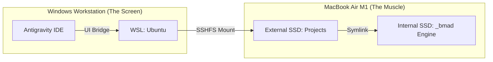

# Walkthrough: God-Mode Server Migration (Phase 1-6)

Director, the MacBook Air M1 has been successfully transformed into a headless, high-performance development server. Your projects are now live on the Mac's external SSD, and your Windows Antigravity IDE is linked directly to them.

## Final Architecture
The following diagram illustrates the completed "Muscle & Screen" setup:



## Key Deliverables

### 1. Unified Project Storage (Total Portfolio: 19 Projects)
*   **Path on Mac:** `/Volumes/Cob-SSD/Projects/`
*   **Mapped in WSL:** `/home/cobautista/macserver/`
*   **The Symlink:** The `_bmad` engine is successfully linked natively across ALL 19 projects.

#### Portfolios Migrated:
*   **`aivate.net/`** (9 Projects)
*   **`personal/`** (3 Projects)
*   **`simple.biz/`** (7 Projects)

### 2. High-Performance Toolchain
*   **tmux & tmuxinator:** Installed and configured for persistent sessions.
*   **Claude Code:** Fully operational on the Mac server.
*   **Tailscale:** Providing an encrypted "Zero-Trust" bridge between your machines.

## How to Resume Work Anytime
If you restart your computer and need to re-mount the drive:
1.  Open your Ubuntu terminal.
2.  Run the "Magic Mounting" command:
    ```bash
    sshfs cob@100.72.109.37:/Volumes/Cob-SSD/Projects ~/macserver -o allow_other
    ```
3.  Open Antigravity and navigate to `~/macserver`.

## Verified Status
- [x] **Automatic Login:** Mac boots straight to desktop.
- [x] **Network Visibility:** Accessible via `100.72.109.37` (Tailscale).
- [x] **Disk Access:** Full Disk Access granted for SSD management.
- [x] **Project Integrity:** `npm run dev` and `git` confirmed working on the Mac.

Director, the foundation is solid. You are now coding with the full power of M1 Silicon while maintaining the comfort of your Windows environment.

**Mission Accomplished.**
